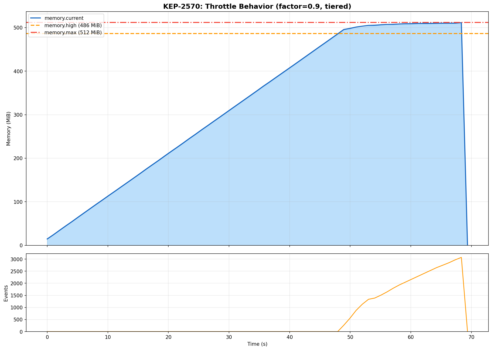
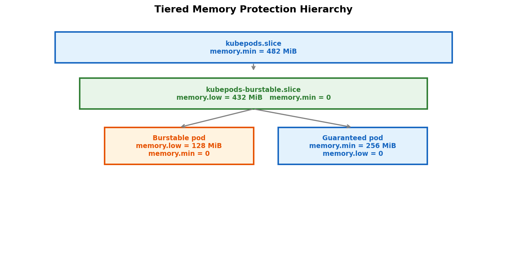
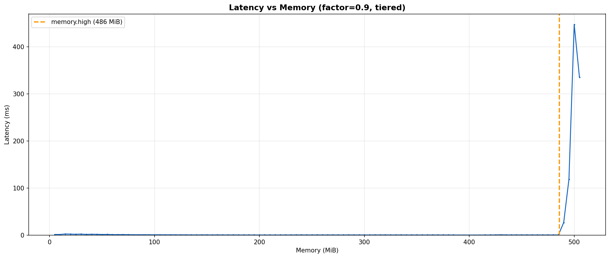

# KEP-2570: MemoryQoS Benchmark Results

## Summary

The kernel livelock that blocked beta in v1.28 is resolved on kernels >= 5.9. With the default `memoryThrottlingFactor=0.9`, a container that exceeds `memory.high` reaches OOM-kill within ~71 seconds rather than getting stuck indefinitely. Latency degrades progressively past `memory.high`, from sub-millisecond baseline to over 1 second at 505 MiB (19 MiB above the threshold), rather than as a sudden cliff.

Tiered memory protection works as expected: Guaranteed pods get `memory.min` (hard, kernel never reclaims), Burstable pods get `memory.low` (soft, kernel prefers not to reclaim). The hierarchy propagates correctly across container, pod, QoS class, and kubepods root levels. Kubelet overhead measured at 2% CPU for 50 pods in this single-node kind setup.

On rollback, QoS-class and pod-level values clear to zero when the feature is properly disabled. Both `memoryReservationPolicy` and the feature gate must be removed before restarting the kubelet. Container-level values persist because they are set via the cgroup `Unified` map at container creation and require CRI runtime support to update at runtime.

---

## Test Environment

| Component | Version |
|-----------|---------|
| Kernel | 6.18.5-100.fc42.x86_64 |
| Kubelet | v1.36.0-alpha.2 (commit [c8468eacac5](https://github.com/sohankunkerkar/kubernetes/commit/c8468eacac5), tiered approach) |
| Container Runtime | containerd 2.2.0 |
| Cluster | kind, single control-plane node (fresh cluster) |
| cgroup | v2 |

Kubelet configuration: [`manifests/kind-cluster.yaml`](manifests/kind-cluster.yaml). System pods (coredns, kube-proxy, etc.) were running during all tests.

Data was collected by polling cgroup files every 1s from the container's cgroup path on the node. Collection script: [`scripts/collect-cgroup-data.sh`](scripts/collect-cgroup-data.sh).

---

## 1. memory.high Throttle Behavior (Livelock Fix)

**Pod spec**: [`manifests/throttle-test-pod.yaml`](manifests/throttle-test-pod.yaml) - Burstable pod, requests=256Mi, limits=512Mi.

`memory.high` = 256 + 0.9 * (512 - 256) = 486.4 MiB

| Metric | Value |
|--------|-------|
| Time to reach memory.high | ~49s |
| Peak memory | 511 MiB |
| Total `memory.events` high counter | 3,596 |
| Duration to OOM-kill | 71s |
| Pod exit reason | OOMKilled |

Raw data: [`data/01-throttle-test-factor-0.9.csv`](data/01-throttle-test-factor-0.9.csv)



---

## 2. Tiered Memory Protection

Guaranteed pods get `memory.min` (hard protection). Burstable pods get `memory.low` (soft protection).

| QoS Class | memory.min | memory.low | memory.high |
|-----------|-----------|-----------|------------|
| Burstable (req=128Mi, lim=256Mi) | 0 | 128 MiB | 243 MiB |
| Guaranteed (req=lim=256Mi) | 256 MiB | 0 | max |
| BestEffort | 0 | 0 | max |

### Multi-container pod (Burstable)

| Resource | memory.low | memory.high |
|----------|-----------|------------|
| Container A (req=128Mi, lim=256Mi) | 128 MiB | 243 MiB |
| Container B (req=64Mi, lim=128Mi) | 64 MiB | 121 MiB |
| **Pod total** | **192 MiB** | -- |

### Cgroup hierarchy

| Level | memory.min | memory.low |
|-------|-----------|-----------|
| kubepods.slice | 290 MiB | -- |
| kubepods-burstable.slice | 0 | 240 MiB |



kubepods root `memory.min` covers total protected memory (guaranteed + burstable) so the kernel's effective protection hierarchy works correctly. Burstable QoS cgroup uses `memory.low` instead of `memory.min`.

---

## 3. Application Latency Impact

Measured operation latency while gradually allocating memory from 0 to 512 MiB with memory.high at 486 MiB.

| Memory | Latency | Ratio vs baseline |
|--------|---------|-------------------|
| 0-485 MiB | ~0.5ms | 1x |
| 490 MiB | 27ms | ~54x |
| 495 MiB | 119ms | ~238x |
| 500 MiB | 448ms | ~896x |
| 505 MiB | 336ms | ~672x |

Raw data: [`data/latency-impact-factor-0.9.csv`](data/latency-impact-factor-0.9.csv)



The `memory.events` high counter is the most direct kernel-native signal for this throttling.

---

## 4. Node-Level Metric

```
# HELP kubelet_memory_qos_protected_bytes_total Total cgroup v2 protected memory
# in bytes across all pods on the node (memory.min for Guaranteed, memory.low for Burstable).
# TYPE kubelet_memory_qos_protected_bytes_total gauge
kubelet_memory_qos_protected_bytes_total 5.05413632e+08
```

505 MiB = total protected memory across all pods. Updated every 60 seconds.

---

## 5. No-Limit Pod

Burstable pod with requests=128Mi, no memory limit. Node allocatable: 63,996 MiB.

| cgroup knob | Value |
|-------------|-------|
| memory.low | 128 MiB |
| memory.high | 57,609 MiB |
| memory.max | `max` |

`memory.high = 128 + 0.9 * (63,996 - 128) = 57,609 MiB`.

---

## 6. Repeated Trials

Three runs of the throttle test on the same fresh cluster.

| Trial | Duration (s) | Throttle events | Outcome |
|-------|-------------|-----------------|---------|
| 1 | 65 | 3,171 | OOMKilled |
| 2 | 59 | 2,337 | OOMKilled |
| 3 | 59 | 2,286 | OOMKilled |

Consistent results (59-65s, 9% spread).

---

## Notes

- `memoryThrottlingFactor=0.9` is the kubelet default. All tests use this value.
- memory.high formula: `floor[(requests + factor * (limits - requests)) / pageSize] * pageSize`. MiB values in tables are rounded from exact byte values.
- Tiered approach: Guaranteed pods get `memory.min`, Burstable pods get `memory.low`. This avoids hard-locking memory for overcommitted workloads (kubernetes/kubernetes#131077).
- Data was collected by polling cgroup files directly on the node (not via kubelet API).

---

## References

- [KEP-2570: Memory QoS](https://github.com/kubernetes/enhancements/issues/2570)
- [Kernel livelock fix (5.9)](https://github.com/torvalds/linux/commit/b3ff92916af)
- [Tiered approach discussion](https://github.com/kubernetes/kubernetes/issues/131077)
- [cgroup v2 memory controller docs](https://docs.kernel.org/admin-guide/cgroup-v2.html)
- [Kubelet PR #137719](https://github.com/kubernetes/kubernetes/pull/137719)
