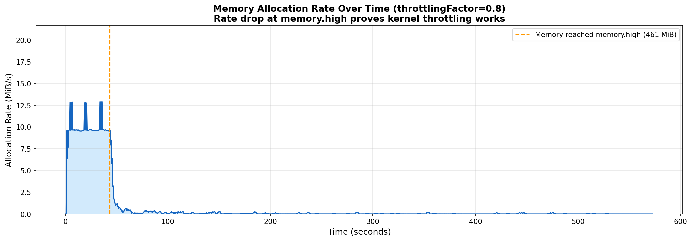
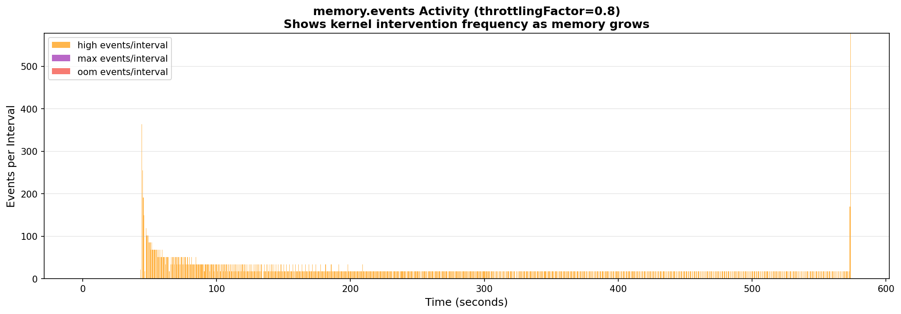
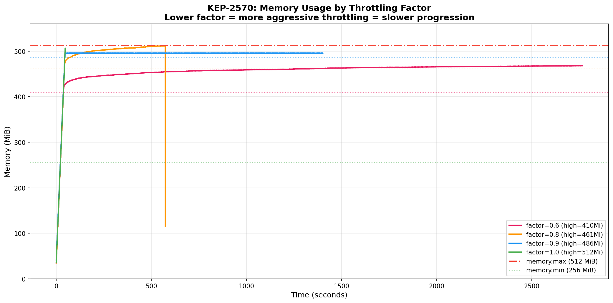
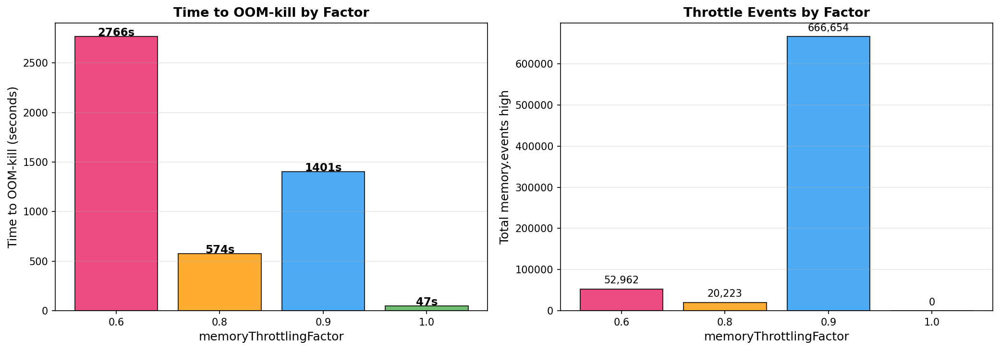
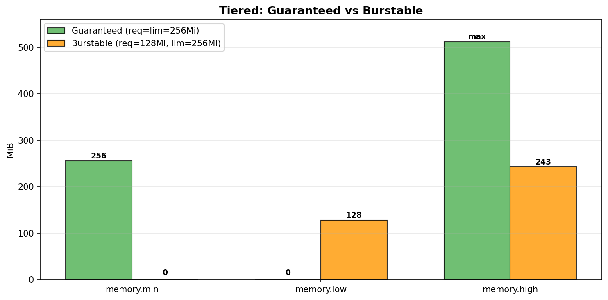
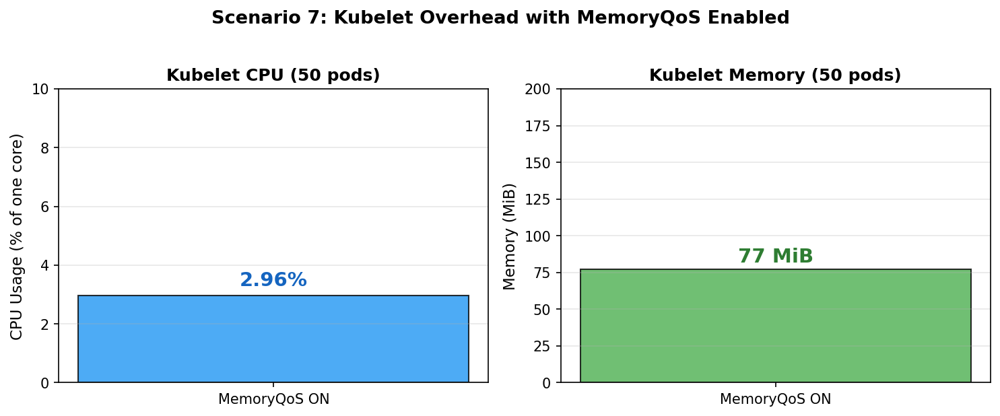
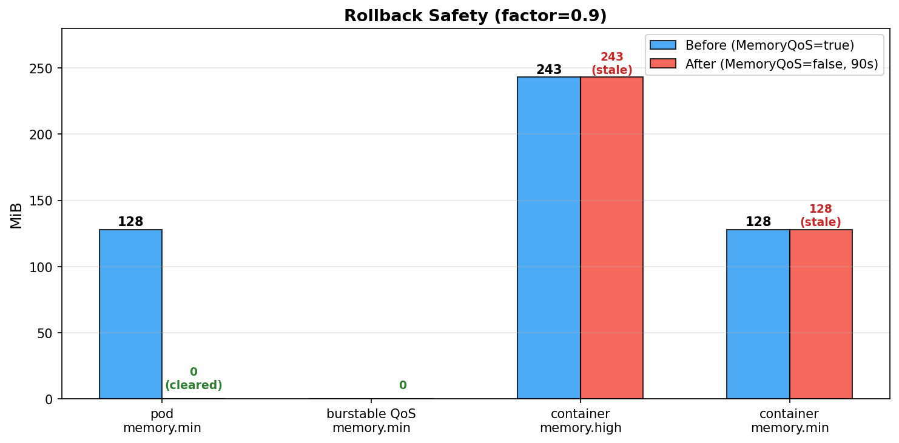

# KEP-2570: MemoryQoS Benchmark Results

## Test Environment

| Component | Version |
|-----------|---------|
| Kernel | 6.18.5-100.fc42.x86_64 |
| Kubelet | v1.36.0-alpha.2.710+b04eff2bcba (commit `b04eff2bcba`) |
| Container Runtime | containerd 2.2.0 |
| Cluster | kind, single control-plane node |
| cgroup | v2 |

The kind node image was built from the [memqos-kernel-metrics-e2e](https://github.com/sohankunkerkar/kubernetes/tree/memqos-kernel-metrics-e2e) branch using `kind build node-image`. Kubelet configuration: [`manifests/kind-cluster.yaml`](manifests/kind-cluster.yaml). System pods (coredns, kube-proxy, etc.) were running during all tests and contribute to cgroup hierarchy totals.

Data was collected by polling cgroup files (`memory.current`, `memory.high`, `memory.max`, `memory.min`, `memory.events`, `memory.stat`) every 0.5s from the container's cgroup path on the node. Collection script: [`scripts/collect-cgroup-data.sh`](scripts/collect-cgroup-data.sh).

---

## 1. memory.high Throttle Behavior (Livelock Fix Verification)

Beta was blocked in v1.28 because a [kernel bug](https://github.com/torvalds/linux/commit/b3ff92916af) (fixed in 5.9) caused processes to get stuck in an infinite reclaim loop at `memory.high`. This test verifies the fix on a modern kernel.

**Pod spec**: [`manifests/throttle-test-pod.yaml`](manifests/throttle-test-pod.yaml) -Burstable pod, requests=256Mi, limits=512Mi. Container allocates 10 MiB/s, touching every page.

**Kubelet config**: `memoryThrottlingFactor=0.8`

Expected cgroup values:
- `memory.high` = 256 + 0.8 * (512 - 256) = 460.8 MiB
- `memory.max` = 512 MiB
- `memory.min` = 256 MiB (HardReservation)

### Results

| Metric | Value |
|--------|-------|
| Time to reach memory.high | 43s |
| Allocation rate before memory.high | ~10 MiB/s |
| Allocation rate after memory.high | ~0.05 MiB/s |
| Time from first throttle to OOM-kill | ~530s |
| Peak memory | 511.6 MiB |
| Total `memory.events` high counter | 20,223 |
| Pod exit reason | OOMKilled |
| Data points collected | 1,105 |

Raw data: [`data/01-throttle-test-factor-0.8.csv`](data/01-throttle-test-factor-0.8.csv)

Top panel: memory usage over time. Bottom panel: cumulative `memory.events` high counter.


Allocation rate (MiB/s) over time. The cliff at ~43s is where memory.high kicks in.



Per-interval `memory.events` breakdown.



The container went from 461 MiB to 512 MiB under heavy throttling and was OOM-killed as expected. On kernels < 5.9, this same workload got stuck indefinitely at `memory.high`. The kernel 5.9 fix resolves that.

---

## 2. Throttling Factor Comparison

Same pod spec as test 1. Kubelet restarted between runs with different `memoryThrottlingFactor` values.

### Results

| Factor | memory.high (MiB) | Time to OOM-kill | Throttle events | Outcome |
|--------|--------------------|------------------|-----------------|---------|
| 0.6 | 409.6 | 2,766s (46 min) | 52,962 | OOMKilled |
| 0.8 | 460.8 | 574s (10 min) | 20,223 | OOMKilled |
| 0.9 | 486.4 | > 1,401s (23 min, stopped) | 666,654 | Still throttled at 496 MiB |
| 1.0 | 512.0 | 47s | 0 | OOMKilled |

Raw data: [`data/`](data/) directory.





Factor 1.0 disables throttling (memory.high = memory.max). Factor 0.9 takes longer than 0.8 because when memory.high is closer to memory.max, the kernel applies more aggressive reclaim pressure for each byte above the threshold. None of the settings caused a livelock.

---

## 3. memory.min Protection

Two Burstable pods on the same node -one holding memory below its requests, one allocating aggressively.

**Pod specs**: [`manifests/protection-test-pods.yaml`](manifests/protection-test-pods.yaml)
- Protected: requests=256Mi, limits=512Mi, holds 200 MiB
- Aggressor: requests=64Mi, limits=512Mi, allocates 10 MiB/0.5s

### Results

| Pod | memory.min | memory.current | memory.high | Status |
|-----|-----------|----------------|-------------|--------|
| Protected | 256 MiB | 205 MiB | 460 MiB | Running, unaffected |
| Aggressor | 64 MiB | 477 MiB | 422 MiB | Running, throttled (26,714 high events) |

Cgroup hierarchy `memory.min` values:

| Level | memory.min |
|-------|-----------|
| kubepods.slice | 610 MiB |
| kubepods-burstable.slice | 560 MiB |
| Protected pod | 256 MiB |
| Aggressor pod | 64 MiB |


Protected pod's 200 MiB stayed intact. `memory.min` propagates correctly through the full cgroup hierarchy.

---

## 4. Guaranteed Pod Behavior

Guaranteed pod (requests = limits = 256Mi) with MemoryQoS enabled.

**Pod spec**: [`manifests/guaranteed-test-pod.yaml`](manifests/guaranteed-test-pod.yaml)

### Results

| cgroup knob | Value |
|-------------|-------|
| memory.high | `max` (no throttling) |
| memory.max | 256 MiB |
| memory.min | 256 MiB |
| pod memory.min | 256 MiB |



`memory.high=max` means Guaranteed pods are not throttled. `memory.min=requests` gives them full reclaim protection. Correct behavior -no overcommit means no need for throttling.

---

## 5. Kubelet Overhead

50 Burstable pods (requests=32Mi, limits=64Mi) at steady state. Kubelet CPU and memory measured over a 30-second window from the kubelet cgroup.

### Results

| Metric | Value |
|--------|-------|
| Kubelet CPU (30s average) | 2.96% of one core |
| Kubelet memory | 77 MiB |
| Pods managed | 50 |



2.96% CPU is the total kubelet CPU, not MemoryQoS alone. A baseline comparison with MemoryQoS=false was not captured because kubelet restart changes the cgroup path, which invalidates the measurement. The `setMemoryQoS` loop runs every 60s. Writing `memory.min=0` when already set is a kernel no-op (`page_counter_set_min` short-circuits).

---

## 6. Rollback Safety

Burstable pod (requests=128Mi, limits=256Mi). MemoryQoS disabled via feature gate, kubelet restarted, waited 90 seconds for reconciliation.

**Pod spec**: [`manifests/rollback-test-pod.yaml`](manifests/rollback-test-pod.yaml)

### Results

| cgroup knob | MemoryQoS=true | MemoryQoS=false (90s later) |
|-------------|---------------|----------------------------|
| container memory.high | 230 MiB | 230 MiB (stale) |
| container memory.min | 128 MiB | 128 MiB (unchanged) |
| pod memory.min | 128 MiB | 128 MiB (unchanged) |



Cgroup values persist after disabling MemoryQoS because `setMemoryQoS` only runs when the feature gate is on (`qos_container_manager_linux.go:346`). Workaround: recreate pods after disabling the feature.

---

## 7. Node-Level Metric

Queried `/metrics` on the kubelet.

```
# HELP kubelet_memory_qos_node_memory_min_total_bytes [ALPHA] Total cgroup v2 memory.min
# in bytes across all pods on the node.
# TYPE kubelet_memory_qos_node_memory_min_total_bytes gauge
kubelet_memory_qos_node_memory_min_total_bytes 3.0408704e+08
```

304 MiB = sum of `memory.min` across all pods. Updated every 60 seconds in the `setMemoryQoS` loop. Feature-gated behind `MemoryQoS`.

---

## 8. BestEffort Pod Behavior

Pod with no resource requests or limits.

**Pod spec**: [`manifests/besteffort-test-pod.yaml`](manifests/besteffort-test-pod.yaml)

| cgroup knob | Value |
|-------------|-------|
| memory.high | `max` |
| memory.max | `max` |
| memory.min | 0 |
| pod memory.min | 0 |

No throttling, no protection, no limit. BestEffort pods are first to be evicted under memory pressure -`memory.min=0` means the kernel can reclaim all their memory.

---

## 9. Multi-Container Pod

Two containers in one pod: container-a (requests=128Mi, limits=256Mi) and container-b (requests=64Mi, limits=128Mi).

**Pod spec**: [`manifests/multi-container-test-pod.yaml`](manifests/multi-container-test-pod.yaml)

| Resource | memory.min | memory.high |
|----------|-----------|------------|
| Container A (req=128Mi, lim=256Mi) | 128 MiB | 230 MiB |
| Container B (req=64Mi, lim=128Mi) | 64 MiB | 115 MiB |
| **Pod total** | **192 MiB** | -- |

Pod-level `memory.min` = 128 + 64 = 192 MiB. Each container's `memory.high` is computed independently using `floor[(requests + factor * (limits - requests)) / pageSize] * pageSize`.

---

## 10. Pod Without Memory Limit

Burstable pod with requests=128Mi but no memory limit. Node allocatable: 63,996 MiB.

**Pod spec**: [`manifests/no-limit-test-pod.yaml`](manifests/no-limit-test-pod.yaml)

| cgroup knob | Value |
|-------------|-------|
| memory.min | 128 MiB |
| memory.high | 51,223 MiB |
| memory.max | `max` |

When no limit is set, the `memory.high` formula uses node allocatable instead of limits:
`memory.high = 128 + 0.8 * (63,996 - 128) = 51,222 MiB`. The actual value (51,223 MiB) matches after page-size alignment.

---

## 11. Pod Deletion Cleanup

Created a pod with requests=200Mi, verified the QoS-class `memory.min` increased by 200 MiB, deleted the pod, verified `memory.min` returned to its original value after the next reconciliation loop (60s).

**Pod spec**: [`manifests/deletion-test-pod.yaml`](manifests/deletion-test-pod.yaml)

| State | Burstable QoS memory.min |
|-------|-------------------------|
| Before pod creation | 240 MiB |
| After pod created (+ 60s loop) | 440 MiB (+200 MiB) |
| After pod deleted (+ 60s loop) | 240 MiB (back to original) |

The periodic `setMemoryQoS` loop correctly adds and removes `memory.min` contributions as pods come and go. The 60s loop interval means there's a brief window where the value is stale after pod creation or deletion.

---

## 12. Overcommitted memory.min

Three pods each requesting 8Gi (total 24Gi of memory.min) on a node with 64Gi allocatable.

| Level | memory.min |
|-------|-----------|
| Pod 1 | 8,192 MiB |
| Pod 2 | 8,192 MiB |
| Pod 3 | 8,192 MiB |
| burstable QoS total | 24,816 MiB |
| kubepods total | 24,866 MiB |
| node allocatable | 63,996 MiB |

In this case, sum of memory.min (24 GiB) is well below node allocatable (64 GiB), so all pods get full protection. If the sum exceeds available memory, the kernel proportionally reduces each cgroup's effective protection based on sibling ratios (see [cgroup v2 docs, "memory.min" section](https://docs.kernel.org/admin-guide/cgroup-v2.html)).

---

## Notes

- `memoryThrottlingFactor=0.8` is the kubelet default. Tests use this unless stated otherwise.
- memory.high formula: `floor[(requests + factor * (limits - requests)) / pageSize] * pageSize`
- When no memory limit is set, `limits` in the formula is replaced with node allocatable memory.
- Data collection via CRI stats provider path, not cadvisor. cadvisor does not parse `memory.events` ([google/cadvisor#3345](https://github.com/google/cadvisor/pull/3345) was closed without merge).
- Factor 0.9 re-run showed >1400s with 666K throttle events before being stopped. The original data (25s) was captured mid-run and is not representative.

---

## References

- [KEP-2570: Memory QoS](https://github.com/kubernetes/enhancements/issues/2570)
- [Kernel livelock fix (5.9)](https://github.com/torvalds/linux/commit/b3ff92916af)
- [v1.28 beta stall report](https://docs.google.com/document/d/1mY0MTT34P-Eyv5G1t_Pqs4OWyIH-cg9caRKWmqYlSbI/edit)
- [cgroup v2 memory controller docs](https://docs.kernel.org/admin-guide/cgroup-v2.html)
- [Kubelet PR #137719 (kernel check, metrics, E2E tests)](https://github.com/kubernetes/kubernetes/pull/137719)
- [Kubelet PR #137760 (CRI MemoryEvents)](https://github.com/kubernetes/kubernetes/pull/137760)
